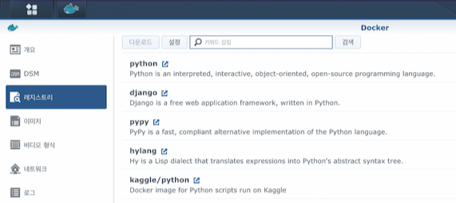
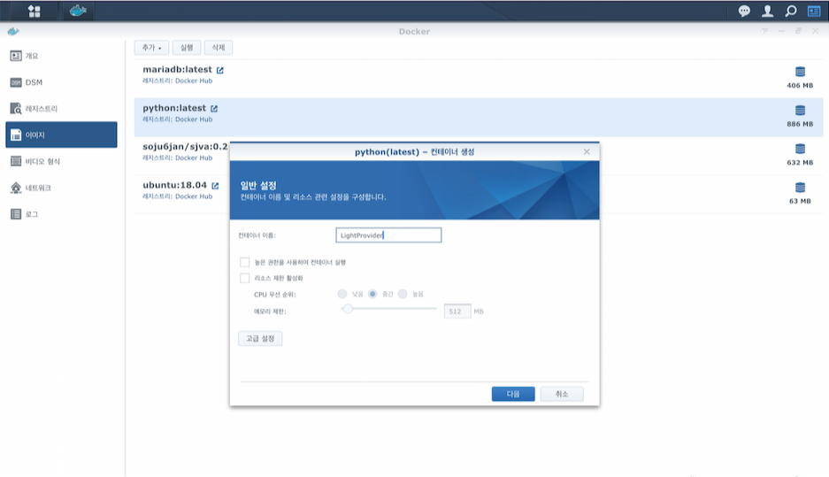
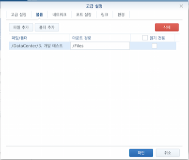
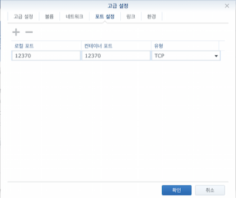
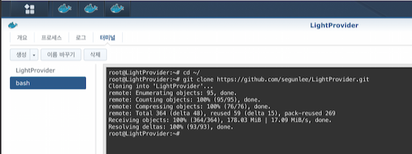

# Synology Docker with LightProvider


## 준비

1. 12370번 서버 포트 열기 (굳이 12370 안쓰시고 직접 지정하셔도 됩니다)
2. Docker 설치 (시놀로지 패키지 센터)


## 서버 설정

1. 웹에서 시놀로지 접속
2. Docker 실행
3. 레지스트리 메뉴로 이동하여 pyhton 검색 후 최상위에 있는 python 다운로드 (버전은 latest)<br /> 
4. 이미지 메뉴로 이동하여 pyhton:latest 더블클릭
5. 컨테이너 이름 직접 지정 (예: LightProvider)<br />
6. 고급 설정 클릭
7. 볼륨탭에 이동하여 설정<br />
    ```
    파일/폴더: 시놀로지에 있는 디렉토리를 지정합니다. (압축된 이미지파일)
    마운트 경로: /Files 로 기입합니다. (추후 해당 내용 사용됨, 다른 이름 사용해도 됩니다.)
    ```
  
8. 포트 설정탭으로 이동하여 설정<br />
    ```
    로컬 포트: 12370
    컨테이너 포트: 12370
    ```
9. 확인을 눌러 고급 설정 완료 후 적용
10. 비디오 형식에 방금 생성한 컨테이너를 선택하여 `세부 사항` 메뉴 클릭
11. 터미널 탭으로 이동 후 `생성` 버튼를 누르면 bash가 생성됨<br />
12. 생성된 bash를 눌러서 아래의 순서대로 타이핑합니다.
     ```
     cd ~/
     
     git clone https://github.com/segunlee/LightProvider.git
     
     cd LightProvider
     
     pip install -r requirements.txt
     
     apt-get install vim 		//lightcomics.json 파일 수정을 위해 설치
     
     vi lightcomics.json
     ```
13. vim 에디터가 열리면 아래와 같이 수정 (vi 사용법을 모르신다면 검색하시면 쉽게 이해할 수 있습니다.)
     ```
     {
     "ROOT": "/Files/",    # 7번에서 기입한 마운트 경로 지정
     "PORT": "12370",			# 열어둔 포트로 지정 (12370)
     "HOST": "0.0.0.0",		# 수정 X
     "PASSWORD": "1234"		# 비밀번호 변경이 필요하다면 수정
     }
     ```
14. 수정이 완료되면 아래 내용 참고
     ```
     sh deploy.sh  # 서버 실행
     sh turnoff.sh # 서버 중지
     ```
15. sh deploy.sh 명령어를 통해 서버 실행
16. 서버 설정 완료


## iOS 앱에서 사용

1. iOS 앱에서 원격저장소 탭메뉴 상단 +를 눌러 LightProvider 선택 (안보인다면 설정 > 실험실에 ON/OFF가 있습니다)
2. 서버 IP 또는 URL을 호스트에 기입
3. 13번에서 지정한 "PASSWORD"에 넣은값 1234를 비밀번호에 기입
4. 13번에서 지정한 "PORT"에 넣은값 12370을 Port에 기입 (기본값으로 삽입되어 있음)
5. 저장


## 참고사항

1. 현재 zip파일만 지원됩니다. (폴더안의 이미지는 지원하지 않습니다)
2. 폴더명에 . 이 들어가 있다면 오류가 발생할 수 있습니다.

